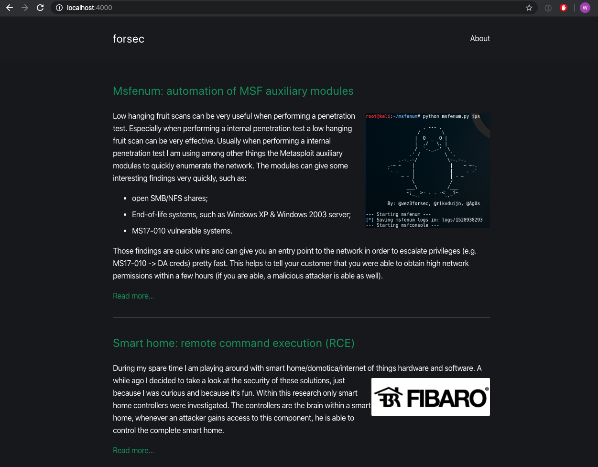
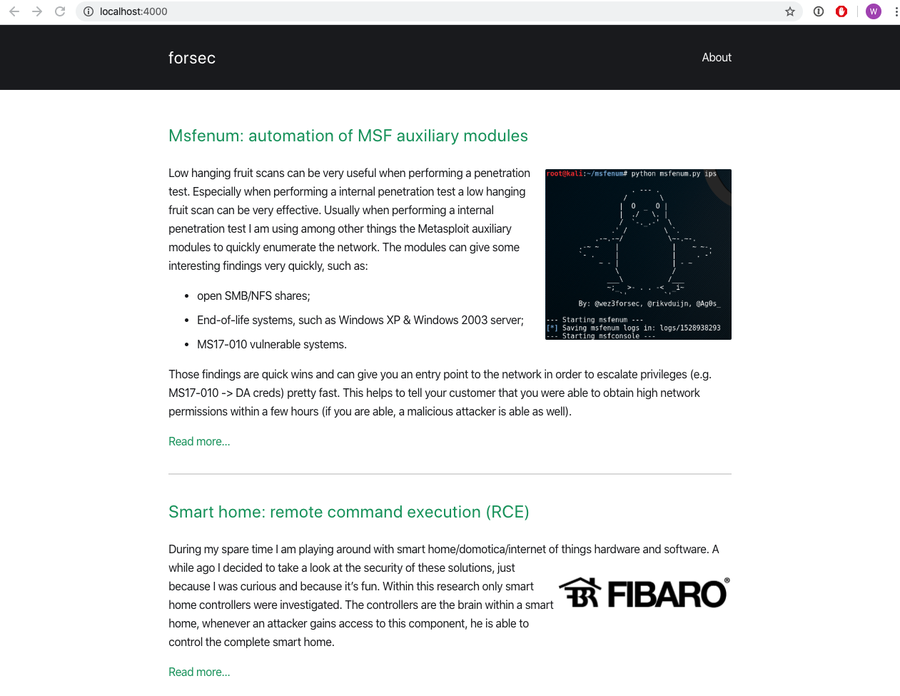

# forsec.nl

This repository contains the Jekyll source code for the website forsec.nl hosted on Github Pages.
The layout is based on the [contrast](https://github.com/niklasbuschmann/contrast) theme.

Screenshot in dark mode:

Screenshot in normal mode:

